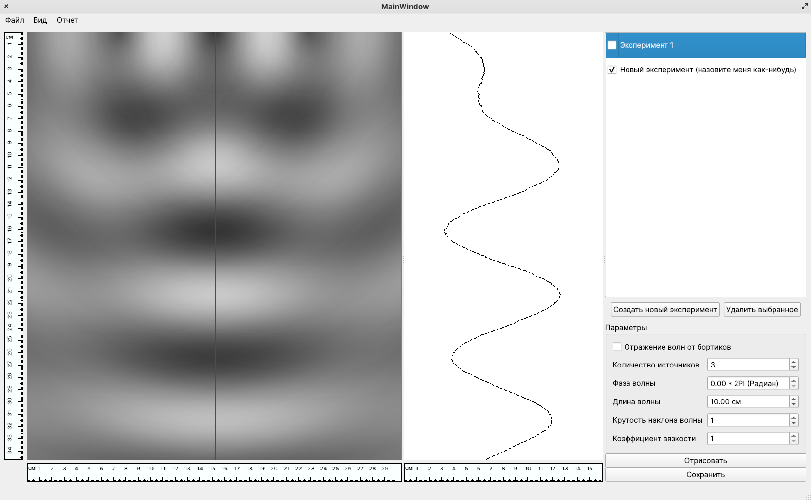

# Проект "Эффект Тальбота на водной поверхности

Данный проект представляет собой программу имитационного моделирования эффекта Тальбота на водной поверхности.

Для сборки проекта из исходных файлов:

```
$ git clone git@github.com:Student-Experimental-Physics-Laboratory/self-water-talbot.git
```

```
$ cd self-water-talbot
```

```
$ qmake && make
```

## Возможности программы



1. Генерация изображения водной поверхности по заданным значениям параметров среды.
2. Вывод графика "разреза" водной среды в направлении распространения начальной плоской волны (вертикально вниз).
3. Сохранение изображения, графика и всех параметров в картинке формата `.png`.
4. Возможность параллельной работы с разными экспериментами.
